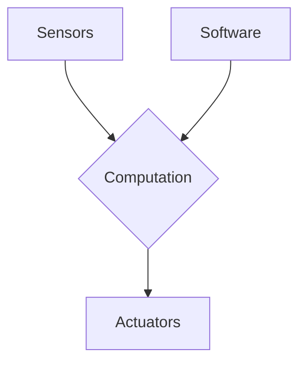

# Chapter 1: Introduction to Physical AI

## 1. Title
Introduction to Physical AI

## 2. Learning Objectives
- Define Physical AI and differentiate it from purely digital AI.
- Understand the importance of embodiment and interaction with the physical world.
- Identify the key components of a Physical AI system.
- Recognize the challenges and opportunities in Physical AI.

## 3. Concept Explanation
Physical AI, also known as Embodied AI, represents a paradigm shift from the disembodied, purely digital AI that resides in servers and processes data to AI that can perceive, reason, and act in the physical world. Unlike AI that only manipulates information, Physical AI interacts with and affects its environment through a physical body.

The core concept is **embodiment**, which means having a body that is subject to the laws of physics. This embodiment allows the AI to have a direct, grounded experience of the world, which is crucial for developing a deeper and more robust understanding of concepts like space, time, and causality.

For example, a digital AI can process millions of images of a cat and learn to recognize them, but it will never truly "know" what a cat is in the way a household robot with Physical AI would. The robot can touch the cat, feel its fur, hear it purr, and learn from these multi-modal sensory inputs.

## 4. System Architecture
A typical Physical AI system consists of several interconnected components:

- **Sensors**: These are the AI's senses, allowing it to perceive the world. Examples include cameras (vision), microphones (hearing), LiDAR (depth perception), and tactile sensors (touch).
- **Actuators**: These are the AI's muscles, enabling it to act upon the world. Examples include motors, grippers, and wheels.
- **Computation**: This is the AI's brain, where the processing of sensory information and decision-making happens. This often involves a combination of traditional processors (CPUs) and specialized hardware for AI workloads (GPUs, TPUs).
- **Software**: This includes the operating system (like ROS 2), the AI models (for perception, control, and reasoning), and the application logic that ties everything together.

*A simplified diagram of a Physical AI system architecture.*

## 5. Practical Examples
- **Autonomous Vehicles**: Cars that use Physical AI to perceive their surroundings and navigate roads safely.
- **Warehouse Robots**: Robots that can pick, pack, and transport goods in a warehouse, interacting with a constantly changing environment.
- **Humanoid Robots**: Robots designed to operate in human-centric environments, performing tasks that range from assistance to exploration.
- **Drones**: Unmanned aerial vehicles that can be used for delivery, inspection, and mapping.

## 6. Tools & Frameworks
- **ROS 2 (Robot Operating System)**: The de-facto standard for robotics software development, providing a set of libraries and tools to help you build robot applications.
- **Gazebo**: A popular open-source robot simulator that allows you to test your robot's software in a virtual environment before deploying it on a physical robot.
- **Python**: The most widely used programming language for AI and robotics, with a rich ecosystem of libraries like TensorFlow, PyTorch, and OpenCV.

## 7. Summary
Physical AI is the future of artificial intelligence. By giving AI a body, we unlock its potential to not only understand the world but to actively participate in it. This chapter has introduced the fundamental concepts of Physical AI, its system architecture, and some of the tools you will be using throughout this book. In the next chapter, we will delve deeper into the principles of embodied intelligence.
