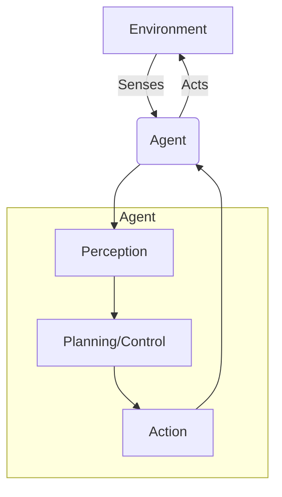

# Chapter 2: Embodied Intelligence Fundamentals

## 1. Title
Embodied Intelligence Fundamentals

## 2. Learning Objectives
- Understand the core principles of Embodied Intelligence.
- Explain the perception-action loop and its significance.
- Describe the role of learning and adaptation in embodied systems.
- Differentiate between model-based and model-free approaches.

## 3. Concept Explanation
Embodied Intelligence is the study of intelligent behavior in the context of a physical body. It posits that intelligence emerges from the interaction between an agent's body, its brain (control system), and its environment. This is in contrast to the traditional view of intelligence as a purely computational process.

The **perception-action loop** is the fundamental cycle that governs the behavior of an embodied agent. The agent perceives the environment through its sensors, processes this information, and then acts upon the environment using its actuators. This action changes the state of the environment, which in turn affects the agent's next perception. This continuous loop is the basis for all learning and behavior.

**Learning and adaptation** are crucial for an embodied agent to function effectively in a dynamic world. The agent must be able to learn from its experiences and adapt its behavior to new situations. This can be achieved through various machine learning techniques, such as reinforcement learning, where an agent learns to maximize a reward signal through trial and error.

## 4. System Architecture
The architecture of an embodied intelligence system is centered around the perception-action loop.

*The Perception-Action Loop.*

- **Perception**: This module is responsible for interpreting the raw sensor data to build a representation of the world. This can involve tasks like object recognition, localization, and mapping.
- **Planning/Control**: This module uses the world representation to make decisions about what to do next. This can range from high-level planning (e.g., "go to the kitchen") to low-level control (e.g., "move the left wheel forward by 10 degrees").
- **Action**: This module translates the decisions into commands for the actuators.

## 5. Practical Examples
- **A robot learning to walk**: Through trial and error, the robot learns which motor commands result in stable locomotion.
- **A self-driving car navigating traffic**: The car continuously perceives the road and other vehicles, and adjusts its speed and steering accordingly.
- **A robotic arm learning to grasp objects**: The arm learns how to shape its gripper and apply the right amount of force to pick up objects of different shapes and sizes.

## 6. Tools & Frameworks
- **OpenAI Gym**: A toolkit for developing and comparing reinforcement learning algorithms. It provides a wide variety of simulated environments for training embodied agents.
- **PyTorch & TensorFlow**: Deep learning frameworks that are widely used for implementing the perception and control modules of an embodied agent.
- **MuJoCo**: A physics engine that is popular for simulating robotic systems, especially for tasks that involve contact dynamics, like grasping and locomotion.

## 7. Summary
Embodied intelligence is a powerful framework for understanding and building intelligent systems that can operate in the real world. By focusing on the interaction between the agent and its environment, we can create robots that are more robust, adaptive, and capable. In the next chapter, we will explore ROS 2, the operating system that will allow us to build the software for our embodied agents.
