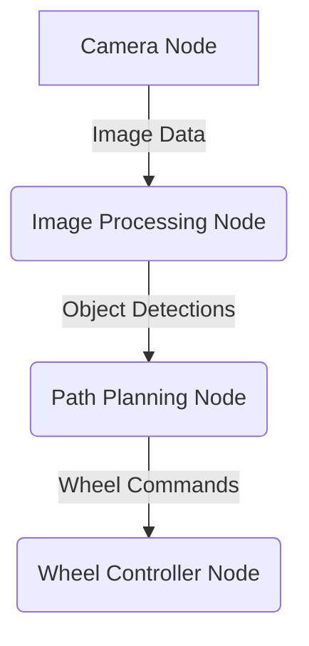

# Chapter 3: ROS 2: The Robotic Nervous System

## 1. Title
ROS 2: The Robotic Nervous System

## 2. Learning Objectives
- Understand the purpose and architecture of ROS 2.
- Learn about the core concepts of ROS 2: nodes, topics, services, and actions.
- Write a simple "hello world" program in ROS 2 using Python.
- Understand how to build and run a ROS 2 workspace.

## 3. Concept Explanation
ROS (Robot Operating System) is a flexible framework for writing robot software. It is a collection of tools, libraries, and conventions that aim to simplify the task of creating complex and robust robot behavior across a wide variety of robotic platforms. ROS 2 is the second generation of ROS, redesigned from the ground up to be more reliable, secure, and suitable for production environments.

Think of ROS 2 as the nervous system of your robot. It allows different parts of your robot's software to communicate with each other, just like how the nervous system carries signals between the brain and the body.

The core concepts of ROS 2 are:
- **Nodes**: A node is a process that performs some computation. A ROS 2 system is typically composed of many nodes, each responsible for a specific task (e.g., a node for controlling the wheels, a node for reading sensor data, a node for planning a path).
- **Topics**: Topics are named buses over which nodes exchange messages. A node can publish messages to a topic, and any node that is subscribed to that topic will receive the messages. This is a one-to-many communication mechanism.
- **Services**: Services are another way for nodes to communicate. They are based on a request-response model. One node offers a service, and another node can call that service with a request and wait for a response. This is a one-to-one communication mechanism.
- **Actions**: Actions are for long-running tasks. They are similar to services, but they provide feedback on the task's progress and allow the task to be preempted.

## 4. System Architecture
A ROS 2 system is a distributed network of nodes.


*An example of a simple ROS 2 system for a mobile robot.*

In this example, the Camera Node publishes raw image data to a topic. The Image Processing Node subscribes to this topic, processes the images to detect objects, and publishes the object detections to another topic. The Path Planning Node subscribes to the object detections and publishes wheel commands to a topic. Finally, the Wheel Controller Node subscribes to the wheel commands and controls the robot's wheels.

## 5. Practical Examples
Let's create a simple "hello world" program in ROS 2. We will create a publisher node that publishes a string message and a subscriber node that listens to that message and prints it to the console.

**Publisher Node (`publisher.py`)**
```python
import rclpy
from rclpy.node import Node
from std_msgs.msg import String

class HelloWorldPublisher(Node):
    def __init__(self):
        super().__init__('hello_world_publisher')
        self.publisher_ = self.create_publisher(String, 'hello_world', 10)
        self.timer = self.create_timer(0.5, self.timer_callback)

    def timer_callback(self):
        msg = String()
        msg.data = 'Hello World from ROS 2'
        self.publisher_.publish(msg)
        self.get_logger().info('Publishing: "%s"' % msg.data)

def main(args=None):
    rclpy.init(args=args)
    publisher = HelloWorldPublisher()
    rclpy.spin(publisher)
    publisher.destroy_node()
    rclpy.shutdown()

if __name__ == '__main__':
    main()
```

**Subscriber Node (`subscriber.py`)**
```python
import rclpy
from rclpy.node import Node
from std_msgs.msg import String

class HelloWorldSubscriber(Node):
    def __init__(self):
        super().__init__('hello_world_subscriber')
        self.subscription = self.create_subscription(
            String,
            'hello_world',
            self.listener_callback,
            10)
        self.subscription  # prevent unused variable warning

    def listener_callback(self, msg):
        self.get_logger().info('I heard: "%s"' % msg.data)

def main(args=None):
    rclpy.init(args=args)
    subscriber = HelloWorldSubscriber()
    rclpy.spin(subscriber)
    subscriber.destroy_node()
    rclpy.shutdown()

if __name__ == '__main__':
    main()
```

## 6. Tools & Frameworks
- **Colcon**: The build tool for ROS 2. It is used to build and install ROS 2 workspaces.
- **Rviz2**: A 3D visualization tool for ROS 2. It allows you to visualize sensor data, robot models, and other information from your ROS 2 system.
- **Gazebo**: The robot simulator, which is tightly integrated with ROS 2.

## 7. Summary
ROS 2 is an essential tool for any roboticist. It provides a powerful and flexible framework for building complex robot applications. In this chapter, you have learned the core concepts of ROS 2 and written your first ROS 2 program. In the next chapter, we will learn how to simulate our robots in Gazebo.
