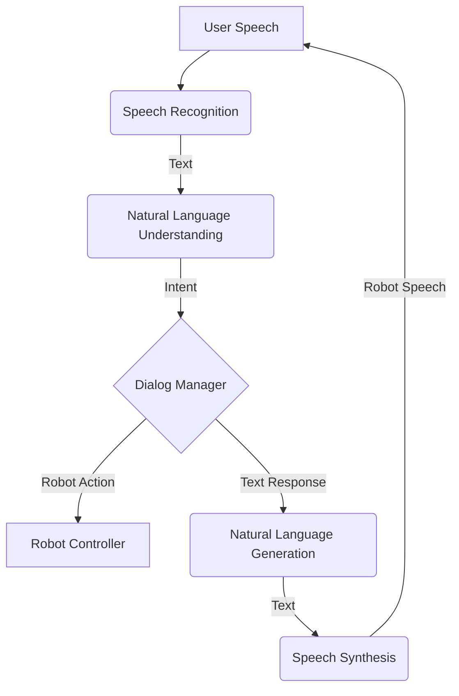

# Chapter 7: Conversational Robotics

## 1. Title
Conversational Robotics

## 2. Learning Objectives
- Understand the role of natural language processing (NLP) in robotics.
- Learn about the components of a conversational robotics system.
- Understand the challenges in building robots that can communicate naturally.
- Explore the use of large language models (LLMs) in robotics.

## 3. Concept Explanation
Conversational robotics is a field of robotics that focuses on creating robots that can communicate and collaborate with humans through natural language. This is a crucial aspect of building robots that can be integrated into our daily lives, as it allows for a more intuitive and user-friendly way of interacting with them.

A conversational robotics system typically consists of several components:
- **Speech Recognition**: This module converts the user's spoken language into text.
- **Natural Language Understanding (NLU)**: This module processes the text to understand the user's intent.
- **Dialog Management**: This module manages the flow of the conversation and decides what the robot should do or say next.
- **Natural Language Generation (NLG)**: This module generates the robot's response in natural language.
- **Speech Synthesis**: This module converts the robot's response from text to speech.

**Large Language Models (LLMs)**, such as GPT-3 and Gemini, are having a major impact on conversational robotics. These models are capable of understanding and generating human-like text, and they can be used to build more powerful and flexible conversational agents.

## 4. System Architecture
A conversational robotics system integrates NLP with the robot's control system.

*Conversational Robotics System Architecture.*

The dialog manager is the core of the system. It receives the user's intent from the NLU module and decides whether to take an action, say something, or both.

## 5. Practical Examples
- **A robot that can answer questions**: You could ask the robot "What is the weather like today?", and it would use its NLU and NLG capabilities to understand the question and generate an appropriate response.
- **A robot that can follow instructions**: You could tell the robot "Please bring me the book from the table", and it would use its dialog manager to trigger the appropriate action.
- **A robot that can collaborate on a task**: You could work with the robot to assemble a piece of furniture, and the robot would be able to communicate with you to coordinate your actions.

## 6. Tools & Frameworks
- **Rasa**: An open-source framework for building conversational AI. It provides a set of tools for NLU, dialog management, and connecting to various messaging channels.
- **Google Dialogflow**: A cloud-based platform for building conversational agents. It offers a user-friendly interface and pre-built integrations with many services.
- **Hugging Face**: A great resource for pre-trained LLMs and other NLP models.

## 7. Summary
Conversational robotics is a rapidly growing field that is essential for creating robots that can be seamlessly integrated into our society. By combining the power of NLP with the capabilities of robotics, we can build robots that are not only intelligent but also easy and intuitive to interact with. In this chapter, you have learned about the components of a conversational robotics system and the role of LLMs in this field. In the next chapter, we will discuss the important topic of sim-to-real transfer.
