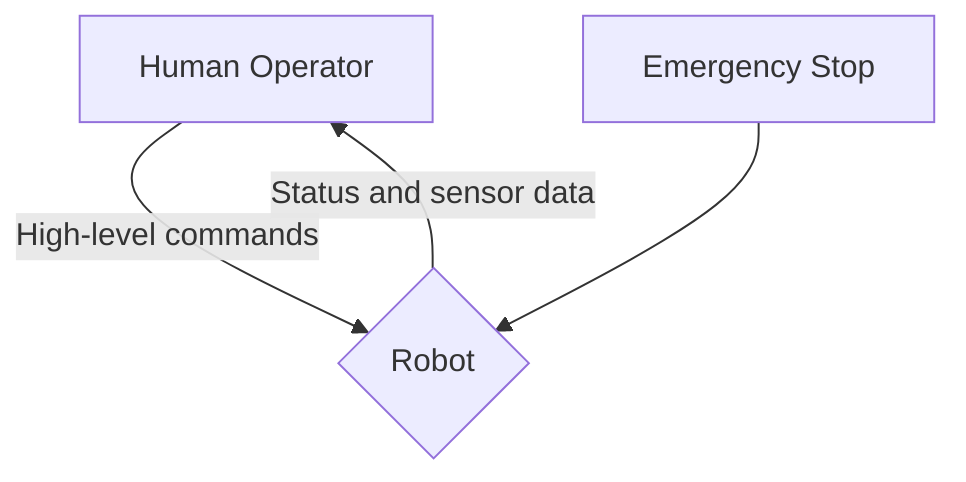

# Chapter 9: Safety, Ethics, and Human Oversight

## 1. Title
Safety, Ethics, and Human Oversight

## 2. Learning Objectives
- Understand the importance of safety in robotics.
- Learn about different methods for ensuring robot safety.
- Explore the ethical considerations in designing and deploying robots.
- Understand the role of human oversight in robotic systems.

## 3. Concept Explanation
As robots become more capable and autonomous, it is increasingly important to consider the safety, ethical, and societal implications of their use. This is a complex and multifaceted topic that requires careful consideration from engineers, policymakers, and the public.

**Safety** is the most important consideration in robotics. A robot that is not safe can cause damage to property, injury to people, or even death. There are many methods for ensuring robot safety, including:
- **Redundancy**: Having backup systems that can take over if a primary system fails.
- **Fail-safes**: Mechanisms that cause the robot to enter a safe state in the event of a failure.
- **Emergency stops**: Buttons or other mechanisms that can be used to immediately stop the robot in an emergency.
- **Formal verification**: Mathematical techniques for proving that a system will not enter an unsafe state.

**Ethics** is another important consideration. As we deploy robots in more and more areas of our lives, we need to think about the ethical implications of their use. For example:
- **Job displacement**: Will robots take jobs away from humans?
- **Privacy**: Will robots with cameras and other sensors be used to spy on us?
- **Bias**: Will robots that are trained on biased data perpetuate and amplify societal biases?
- **Accountability**: Who is responsible when a robot makes a mistake?

**Human oversight** is a crucial aspect of ensuring both the safety and ethical use of robots. It is important to have a human in the loop who can monitor the robot's behavior, intervene if necessary, and make high-level decisions.

## 4. System Architecture
A safe and ethical robotic system should be designed with human oversight in mind.

*Human-in-the-loop Architecture.*

The human operator provides high-level commands to the robot and monitors its status. The operator can intervene at any time, and there is an emergency stop that can be used to immediately shut down the robot.

## 5. Practical Examples
- **A self-driving car with a safety driver**: The safety driver is a human who is ready to take over control of the car at any time.
- **A surgical robot that is controlled by a surgeon**: The surgeon is in full control of the robot, and the robot is simply an extension of the surgeon's hands.
- **A factory robot that operates in a cage**: The cage prevents the robot from coming into contact with humans.

## 6. Tools & Frameworks
- **FMEA (Failure Mode and Effects Analysis)**: A structured approach to identifying potential failures in a system and their consequences.
- **HAZOP (Hazard and Operability Study)**: A systematic method for identifying and evaluating potential hazards in a system.

## 7. Summary
Safety, ethics, and human oversight are essential considerations in the design and deployment of robotic systems. As robotics engineers, we have a responsibility to ensure that our creations are safe, ethical, and beneficial to society. In this chapter, you have learned about some of the key issues in this area and some of the methods that are used to address them. In the final chapter, we will put everything you have learned together in a capstone project.
